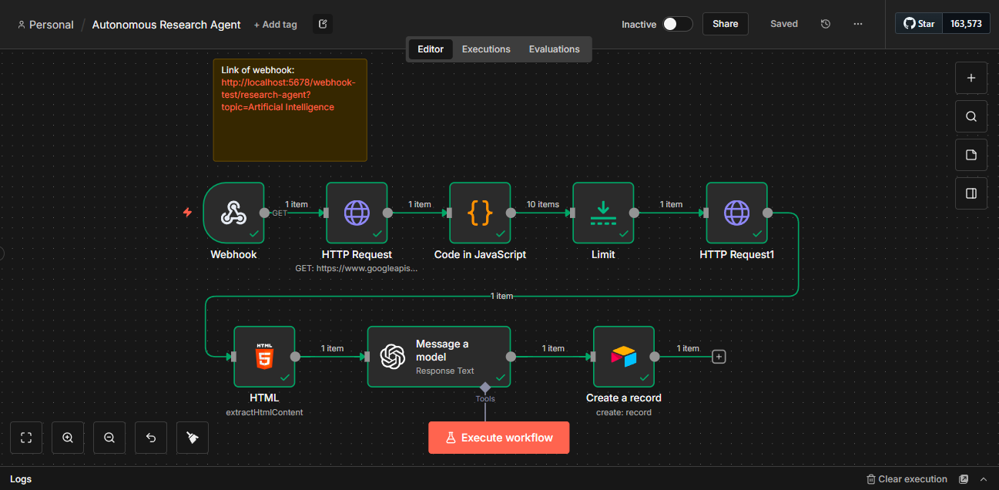

# Autonomous Market Research Agent 🕵️‍♂️

## 📋 Project Overview
This intelligent agent automates the tedious process of market research. Instead of manually searching, reading, and summarizing articles, this workflow accepts a topic, finds credible sources, analyzes the content using AI, and automatically logs the insights into a database.

## 🛠️ Tech Stack
* **n8n** (Workflow Automation)
* **Google Custom Search API** (Source Discovery)
* **OpenAI GPT-4o-mini** (Content Analysis & Summarization)
* **Airtable** (Structured Database)
* **HTML Extraction** (Web Scraping)

## 📸 Workflow

## 🚀 How it Works
1.  **Trigger:** The workflow starts with a search keyword (e.g., "AI Trends 2025").
2.  **Search:** Connects to Google's API to find the top relevant articles.
3.  **Scrape:** An HTTP Request downloads the website code, and an HTML Extract node pulls only the readable text.
4.  **Analyze:** GPT-4o reads the raw text and generates a concise executive summary.
5.  **Store:** The final summary, source link, and status are automatically added to an Airtable database.

## 📂 How to Use
1.  **Download:** Get the `workflow.json` file from this repository.
2.  **Import:** Open n8n, go to "Workflows," and select "Import from File."
3.  **Credentials:** You will need to add your own API keys for:
    * OpenAI
    * Google Custom Search
    * Airtable (Personal Access Token)
4.  **Run:** Click execute and watch the database fill up!
