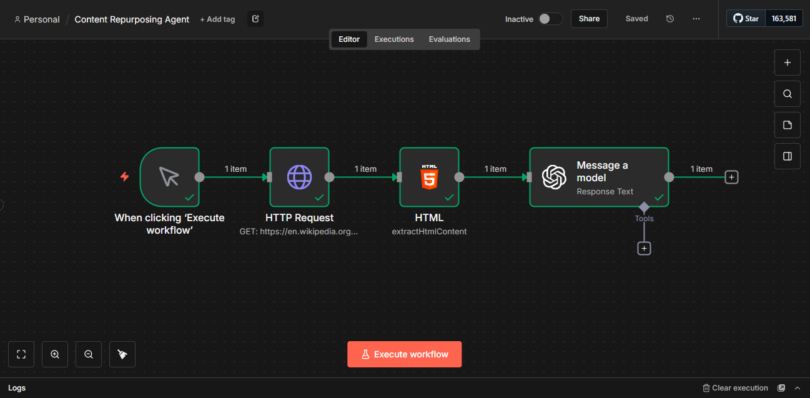

# Autonomous Market Research Agent and Content Repurposing Agent

## 📋 Autonomous Market Research Agent Project Overview
This intelligent agent automates the tedious process of market research. Instead of manually searching, reading, and summarizing articles, this workflow accepts a topic, finds credible sources, analyzes the content using AI, and automatically logs the insights into a database.

## 🛠️ Tech Stack
* **n8n** (Workflow Automation)
* **Google Custom Search API** (Source Discovery)
* **OpenAI GPT-4o-mini** (Content Analysis & Summarization)
* **Airtable** (Structured Database)
* **HTML Extraction** (Web Scraping)

## 📸 Workflow

## 🚀 How it Works
1.  **Trigger:** The workflow starts with a search keyword (e.g., "AI Trends 2025").
2.  **Search:** Connects to Google's API to find the top relevant articles.
3.  **Scrape:** An HTTP Request downloads the website code, and an HTML Extract node pulls only the readable text.
4.  **Analyze:** GPT-4o reads the raw text and generates a concise executive summary.
5.  **Store:** The final summary, source link, and status are automatically added to an Airtable database.

## 📂 How to Use
1.  **Download:** Get the `workflow.json` file from this repository.
2.  **Import:** Open n8n, go to "Workflows," and select "Import from File."
3.  **Credentials:** You will need to add your own API keys for:
    * OpenAI
    * Google Custom Search
    * Airtable (Personal Access Token)
4.  **Run:** Click execute and watch the database fill up!

📋 Content Repurposing Agent Project Overview
This creative automation solves the "create once, distribute everywhere" challenge. It takes a single piece of long-form content (such as a YouTube video transcript or blog post) and instantly transforms it into multiple social media formats. This ensures consistent output across platforms without the burnout of writing every post from scratch.

🛠️ Tech Stack
n8n (Workflow Automation)

OpenAI GPT-4o-mini (Generative Writing & Formatting)

YouTube API / RSS Feed (Content Ingestion)

Airtable (Content Calendar & Database)

Slack (Notification & Approval)

📸 Workflow

🚀 How it Works
Trigger: The workflow activates when a new video is published or a URL is manually submitted.

Extract: It retrieves the full transcript or article text to serve as the context.

Generate: GPT-4o processes the text through multiple prompts to create platform-specific variations (e.g., a "hook-driven" Twitter thread and a "professional" LinkedIn post).

Format: The AI structures the output, adding relevant hashtags and spacing.

Organize: The drafted posts are automatically categorized and saved into an Airtable Content Calendar for final review.

📂 How to Use
Download: Get the repurposing_agent.json file from this repository.

Import: Open n8n, navigate to "Workflows," and import the file.

Credentials: configure your API keys for:

OpenAI

Airtable (Personal Access Token)

Content Source (e.g., YouTube Data API)

Run: Feed it a piece of content and watch your social media calendar fill up!
